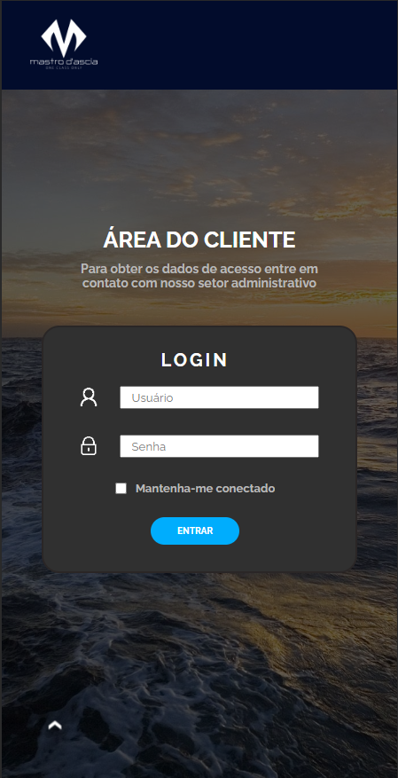
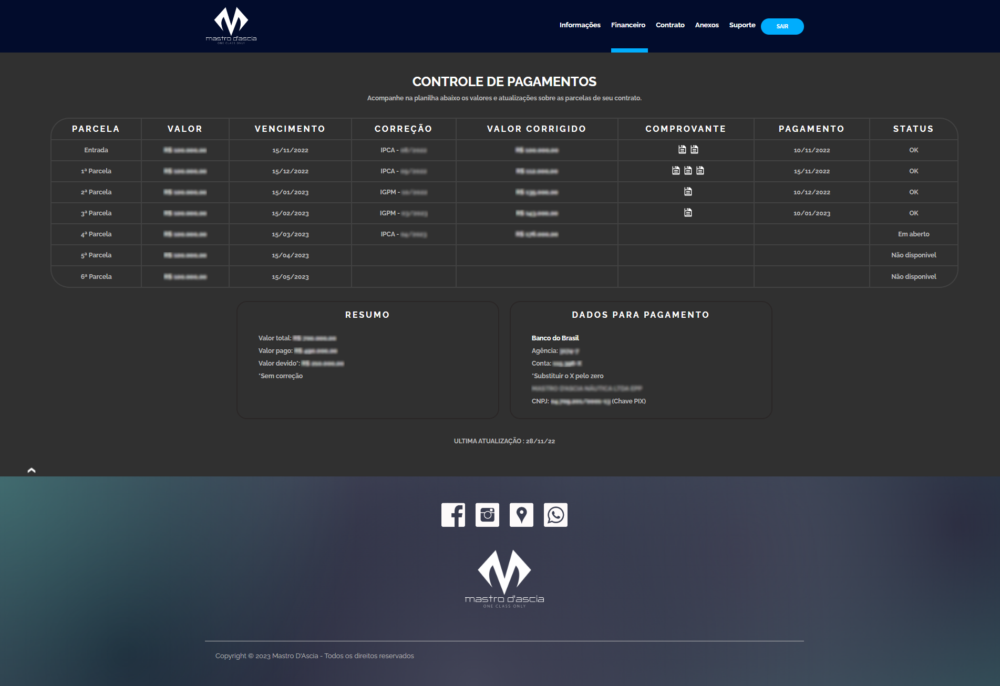

# Painel do Cliente

> Templates enviados

## Imagens

  
    
  
  

  
    
  
  

## Resumo

Página para o cliente ver as compras realizadas, acompanhar os vencimentos, contratos e informações. 

## Versões - Histórico

* 0.1.0
    * Responsividade
    * Adição de conteúdo
* 0.0.1
    * Criação de Template inicial

## 

[https://github.com/JamesOliveira1](https://github.com/JamesOliveira1/)